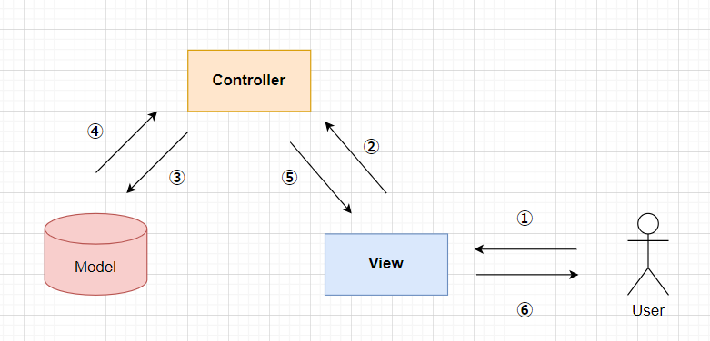

# Custom Tkinter MVC テンプレート設計
 pythonを使用したネイティブアプリの開発を効率的に行えるようテンプレートの設計書です。<br>
 Webフレームワークでよく使われるMVCアーキテクチャを採用しました。

## 要件
 - CustomTkinterを利用したMVCテンプレートを作成すること。
 - 画面は「メインページ」と「設定」の2つを用意する。
 - 出来る限り、あらゆる実装方法が統一化できる構成にする。

## MVCについて
 システム開発においての設計方針の一つです。<br>
 このMVC構成は「Model」　「View」　「Controller」の3つに分けてコードを管理する構成。<br><br>
 

**役割**
- Model: データ管理
- Controller: ビジネスロジック
- View: 画面表示
それぞれの役割は上記の通りです。<br>
※コントローラは管理するビューを決めて、そのビューに関するビジネスロジック処理を定義するものです。<br>

**今回のテンプレートで使用する主なクラスの種類**<br>
| No | クラス名 | 説明 | 備考 |
| ---- | ---- | ---- | ---- |
| 1 | View | 画面デザイン担当。 |
| 2 | Controller | ビジネスロジックを担当。ModelやViewの橋渡しやエラー処理などを行う。 |
| 3 | Model | データの保持を担当。 |
| 4 | CustomCtk | アプリ全体の設定 & コントローラの管理 | コントローラの管理を任せることによりページ遷移などの共通処理を簡単に呼び出せる |
| 5 | App | 各クラスの連携 | CustomCtk、モデル、コントローラのインスタンス生成し、各クラスの連携を行う |

## 設計思想
MVCではクラス同士の関係を疎結合にし、それぞれの独立した形を保つ必要があります。今回、ページの生成をコントローラからViewを呼び出し、行うよう構成を考えたました。その構成のまま、コントローラクラス同士の独立性を保つため、CustomCtkクラスでビューの構成に使うコントローラをすべて、保持し、呼び出していページを指定して表示できるようにしてあります。

**コントローラとビューの独立性を保つためにしたこと**
- ページの生成方法
    <br>コントローラのメソッドでビュークラスのインスタンスを生成して、UI生成を行う。
- コントローラの抽象クラスを作成
    <br>ページの遷移を行うクラスを必ず実装できるようにBaseControllerクラスを使用します。CustomCtkに登録したキーで簡単に呼び出せるようにしました。
- ページ遷移の実現方法
    <br>すべてのコントローラをCustomeCtkクラスでまとめて管理し、そこからページ表示メソッドを呼び出せるよう作成。


## 命名ルール
1. 「Model」「Controller」に該当するクラスは語尾に必ず、該当する構成名を付ける事。

    例: 「Modelクラス」→ ○○Model<br>
 　　「Controllerクラス」 → ○○Contorller<br>
　　上記のようにＭＶＣに関するクラスどの担当をしているのかを分かるようにする。
<br>　　※Viewに関しては名前をキーとして利用するため何のページか分かりやすいように命名する。

# ファイル構成
```
src
 ├── controllers
 │   ├── __init__.py
 │   ├── page1_controller.py
 │   └── page2_controller.py
 ├── core
 │   ├── __init__.py
 │   ├── app.py
 │   ├── base_controller.py
 │   └── custom_ctk.py
 ├── main.py
 ├── models
 │   └── mymodel.py
 └── views
     ├── __init__.py
     ├── page1.py
     └── page2.py
```

　　
# クラス一覧
※引数はコンストラクタの引数です。
| No | クラス名 | 説明 | 引数 | モジュール | 備考 | 
| ---- | ---- | ---- | ---- | ---- | ---- |
| 1 | App | 各種クラスの連携 | 引数1:self | app.py |
| 2 | Page1 | 初期表示画面 | 引数1:self<br>引数2:master(customCtk)<br>引数3:controller(インスタンス)<br>引数4:data(辞書型)<br>引数5:kwargs | page1.py |
| 3 | Page2 | 2ページ目 | 引数1:self<br>引数2:master(customCtk)<br>引数3:controller(インスタンス)<br>引数4:data(辞書型)<br>引数5:kwargs | page1.py |
| 4 | BaseController | ※抽象クラス | 引数1:self<br>引数2:root(customCtk)<br>引数3:ViewClass(ビュークラス)<br>引数4:template_name(キー名) | base_controller.py | BaseControllerを継承 |
| 5 | Page1Controller | Page1画面のビジネスロジック | 引数1:self<br>引数2:root(customCtk)<br>引数3:ViewClass(ビュークラス)<br>引数4:my_model(モデルクラス) | page1_controller.py |
| 6 | Page2Controller | Page2画面のビジネスロジック | 引数1:self<br>引数2:root(customCtk)<br>引数3:ViewClass(ビュークラス)<br>引数4:my_model(モデルクラス) | page2_controller.py | BaseControllerを継承 |
| 7 | MyModel | データ保持クラス | 引数1:self | my_model.py |

# イベント一覧
BaseContorllerの継承とCustomCtkでのコントローラ管理により、どのコントローラクラスからでもgoto_pageメソッドでページ名を指定すれば呼び出せるようになっています。
| No | メソッド名 | 説明 | 引数 | 戻り値 | 使用メソッド | クラス名 |
| ---- | ---- | ---- | ---- | ---- | ---- | ---- |
| 1 | goto_page | ページ2へ遷移<br>※継承元のBaseControllerで定義したgoto_pageをそのままイベントへ登録する | 引数1:self<br>引数2:"Page2" | なし |  | Page1Controller |
| 2 | goto_page | ページ1へ遷移<br>※継承元のBaseControllerで定義したgoto_pageをそのままイベントへ登録する | 引数1:self<br>引数2:"Page1" | なし |  | Page2Controller |

# メソッド・関数一覧

## Appクラスの役割と実装例
Appクラスではアプリ全体の連携を行うクラスです。<br>


## ビューの実装例
1. CTkFrameクラスの継承
1. 初期化処理 （引数のcontrollerとdataをインスタンス変数へ格納）
1. UI生成
``` python
class Page1(ctk.CTkFrame): # ←1.
    def __init__(self, master:ctk.CTk, controller:Any, data:dict|None, **kwargs) -> None:
        super().__init__(master, **kwargs)
        self.controller = controller # ←2.
        self.data = data             # ←3. ※UIの生成メソッド(build_ui)で取り出して使用。

    def build_ui(self) -> None:
        """ UI生成処理
        """
        # 中央にフレーム配置
        self.frame = ctk.CTkFrame(self)
        self.frame.grid(row=0, column=0, padx=20, pady=20)
        # ページタイトル
        self.label = ctk.CTkLabel(self.frame, text="This is Page 1")
        self.label.grid(row=0, column=0, padx=20, pady=20)
        # ページ２に表示するタイトル入力
        self.title_input = ctk.CTkEntry(self.frame, textvariable=self.data["title"], width=300) # ←3
        self.title_input.grid(row=1, column=0, padx=20, pady=20)
        # ページ２に表示するコンテンツ入力
        self.content_input = ctk.CTkEntry(self.frame, textvariable=self.data["content"], width=300) # ←3
        self.content_input.grid(row=2, column=0, padx=20, pady=20)
        # ページ２リンクボタン
        self.button = ctk.CTkButton(self.frame, text="Send", command=partial(self.controller.goto_page, 'Page2'))
        self.button.grid(row=3, column=0, padx=20, pady=20)
```
## コントローラの実装例
1. BaseControllerを継承
1. 必須の引数の設定(root(CustomCtkインスタンス), template_name(ビュー名))
1. BaseControllerのコンストラクタ起動（引数: root((CustomCtkインスタンス)),Page1(担当するクラス), template_name(ビュー名)）
1. ビューに送るデータを設定するメソッドの実装()


```python
class Page1Controller(BaseController):
    def __init__(self, root:Any, my_model:Any=None, template_name:str=None) -> None: # ← 1,2
        """初期化処理

        Args:
            root (Any): CustomCtkクラスのインスタンス
            my_model (_type_, optional): MyModelクラスのインスタンス. Defaults to None.
        """
        super().__init__(root, Page1, template_name) # ← 2. 
        self.my_model = my_model # ←モデルクラスの設定

    # 4. ビューに送るデータを設定するメソッドの実装
    def _send_view_data(self) -> dict:
        """ 画面表示用データを渡す処理

        Returns:
            dict: 表示用データ
        """
        title = self.my_model.title
        content = self.my_model.content
        
        context = {'title': title, 'content': content}
        return context
```

## coreパッケージ
 アプリ全体を管理する汎用的なコードを保持。
#### CustomCTk
#### BaseController
#### App

## modelsパッケージ
 データ管理を担当。
#### mymodel.py

## controllersパッケージ
 ページごとのコントローラを保持。
#### page1_controller.py
#### page2_controller.py

## viewsパッケージ
 ページごとのビューを保持。
#### page1.py
#### page2.py


# メモ
**View**<br>
- Main_View
- Settings_View
<br>

**Controller**<br>
- Main_Controller
- Settings_Controller
<br>

**Model**<br>
- Settings_Model
<br>
